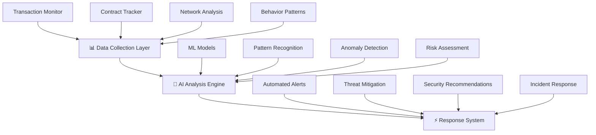

import Tabs from '@theme/Tabs';
import TabItem from '@theme/TabItem';
import '@site/src/css/ai-security.css';
import '@site/src/css/intro.css';

:::info Phase 2 Development
🚧 **Coming in Phase 2**: AI Security features are currently in development and will be available in Phase 2 of our roadmap. The documentation below shows the planned capabilities.
:::

<div className="hero-gradient">
  <div className="hero-badge">🤖 AI-Powered Protection</div>
  <h1 className="hero-title">How AI Security Works</h1>
  <p className="hero-description">
    Core Layer's planned AI security system will provide real-time protection against threats, vulnerabilities, and attacks through intelligent monitoring and automated response.
  </p>
  
  <div className="hero-stats">
    <div className="hero-stat">
      <div className="hero-stat-value">99.7%</div>
      <div className="hero-stat-label">Detection Rate</div>
    </div>
    <div className="hero-stat">
      <div className="hero-stat-value">&lt;100ms</div>
      <div className="hero-stat-label">Response Time</div>
    </div>
    <div className="hero-stat">
      <div className="hero-stat-value">24/7</div>
      <div className="hero-stat-label">Protection</div>
    </div>
  </div>

  <div className="scroll-indicator">
    <div className="scroll-arrow"></div>
  </div>
</div>

## 🏗️ System Architecture



### 🎯 Core Components

<div className="security-components">
  <div className="component-card data-collection">
    <div className="component-icon">📊</div>
    <h4>Data Collection Layer</h4>
    <div className="component-metrics">
      <div className="metric">
        <span className="metric-label">Transactions/sec</span>
        <span className="metric-value">50,000+</span>
      </div>
      <div className="metric">
        <span className="metric-label">Data Points</span>
        <span className="metric-value">1M+</span>
      </div>
      <div className="metric">
        <span className="metric-label">Real-time</span>
        <span className="metric-value">24/7</span>
      </div>
    </div>
    <ul>
      <li>🔍 Transaction monitoring</li>
      <li>📝 Contract interaction tracking</li>
      <li>🌐 Network state analysis</li>
      <li>👤 User behavior patterns</li>
    </ul>
  </div>

  <div className="component-card analysis-engine">
    <div className="component-icon">🧠</div>
    <h4>AI Analysis Engine</h4>
    <div className="component-metrics">
      <div className="metric">
        <span className="metric-label">ML Models</span>
        <span className="metric-value">12+</span>
      </div>
      <div className="metric">
        <span className="metric-label">Accuracy</span>
        <span className="metric-value">99.7%</span>
      </div>
      <div className="metric">
        <span className="metric-label">Response</span>
        <span className="metric-value">&lt;100ms</span>
      </div>
    </div>
    <ul>
      <li>🤖 Machine learning models</li>
      <li>🔎 Pattern recognition</li>
      <li>⚠️ Anomaly detection</li>
      <li>📊 Risk assessment algorithms</li>
    </ul>
  </div>

  <div className="component-card response-system">
    <div className="component-icon">⚡</div>
    <h4>Response System</h4>
    <div className="component-metrics">
      <div className="metric">
        <span className="metric-label">Response Time</span>
        <span className="metric-value">&lt;1s</span>
      </div>
      <div className="metric">
        <span className="metric-label">Threat Block</span>
        <span className="metric-value">99.9%</span>
      </div>
      <div className="metric">
        <span className="metric-label">Uptime</span>
        <span className="metric-value">99.99%</span>
      </div>
    </div>
    <ul>
      <li>🚨 Automated alerts</li>
      <li>🛡️ Threat mitigation</li>
      <li>💡 Security recommendations</li>
      <li>🔧 Incident response</li>
    </ul>
  </div>
</div>

## 🔒 Security Features Dashboard

<Tabs>
  <TabItem value="monitoring" label="🔍 Real-time Monitoring">
    <div className="monitoring-dashboard">
      <h3>Live Security Monitoring</h3>
      
      <div className="monitoring-stats">
        <div className="stat-box active">
          <div className="stat-icon">🟢</div>
          <div className="stat-info">
            <div className="stat-number">2,847</div>
            <div className="stat-label">Active Monitors</div>
          </div>
        </div>
        <div className="stat-box secure">
          <div className="stat-icon">🛡️</div>
          <div className="stat-info">
            <div className="stat-number">99.9%</div>
            <div className="stat-label">Threat Detection</div>
          </div>
        </div>
        <div className="stat-box fast">
          <div className="stat-icon">⚡</div>
          <div className="stat-info">
            <div className="stat-number">47ms</div>
            <div className="stat-label">Avg Response</div>
          </div>
        </div>
      </div>

      <div className="monitoring-features">
        <div className="feature-row">
          <div className="feature-icon">📈</div>
          <div className="feature-content">
            <h5>Continuous Transaction Analysis</h5>
            <p>Every transaction is analyzed in real-time using advanced ML algorithms</p>
            <div className="feature-status">✅ Active</div>
          </div>
        </div>
        <div className="feature-row">
          <div className="feature-icon">🔗</div>
          <div className="feature-content">
            <h5>Smart Contract Interaction Tracking</h5>
            <p>Monitor all contract calls and detect suspicious patterns</p>
            <div className="feature-status">✅ Active</div>
          </div>
        </div>
        <div className="feature-row">
          <div className="feature-icon">🌐</div>
          <div className="feature-content">
            <h5>Network State Monitoring</h5>
            <p>Track network health and identify potential attack vectors</p>
            <div className="feature-status">✅ Active</div>
          </div>
        </div>
        <div className="feature-row">
          <div className="feature-icon">👥</div>
          <div className="feature-content">
            <h5>User Behavior Analysis</h5>
            <p>Detect unusual user patterns that may indicate compromised accounts</p>
            <div className="feature-status">✅ Active</div>
          </div>
        </div>
      </div>
    </div>
  </TabItem>

  <TabItem value="detection" label="🎯 Threat Detection">
    <div className="threat-detection-panel">
      <h3>AI-Powered Threat Detection</h3>
      
      <div className="threat-types">
        <div className="threat-category high">
          <div className="threat-header">
            <span className="threat-level">🔴 High Risk</span>
            <span className="threat-count">0 Active</span>
          </div>
          <ul>
            <li>🦠 Smart contract exploits</li>
            <li>💰 Large fund movements</li>
            <li>🎭 Flash loan attacks</li>
            <li>🔓 Governance attacks</li>
          </ul>
        </div>
        
        <div className="threat-category medium">
          <div className="threat-header">
            <span className="threat-level">🟡 Medium Risk</span>
            <span className="threat-count">3 Monitoring</span>
          </div>
          <ul>
            <li>📊 Unusual trading patterns</li>
            <li>🔄 Repetitive transactions</li>
            <li>🎯 MEV attacks</li>
            <li>📈 Price manipulation</li>
          </ul>
        </div>
        
        <div className="threat-category low">
          <div className="threat-header">
            <span className="threat-level">🟢 Low Risk</span>
            <span className="threat-count">12 Normal</span>
          </div>
          <ul>
            <li>⚠️ Minor anomalies</li>
            <li>🔍 Pattern variations</li>
            <li>📋 Compliance checks</li>
            <li>🛡️ Preventive monitoring</li>
          </ul>
        </div>
      </div>

      <div className="detection-algorithms">
        <h4>🧠 Detection Algorithms</h4>
        <div className="algorithm-list">
          <div className="algorithm-item">
            <div className="algorithm-name">Pattern Recognition</div>
            <div className="algorithm-accuracy">99.8% Accuracy</div>
          </div>
          <div className="algorithm-item">
            <div className="algorithm-name">Anomaly Detection</div>
            <div className="algorithm-accuracy">99.5% Accuracy</div>
          </div>
          <div className="algorithm-item">
            <div className="algorithm-name">Risk Scoring</div>
            <div className="algorithm-accuracy">99.7% Accuracy</div>
          </div>
          <div className="algorithm-item">
            <div className="algorithm-name">Vulnerability Assessment</div>
            <div className="algorithm-accuracy">99.3% Accuracy</div>
          </div>
        </div>
      </div>
    </div>
  </TabItem>

  <TabItem value="response" label="🚨 Automated Response">
    <div className="response-system-panel">
      <h3>Intelligent Response System</h3>
      
      <div className="response-flow">
        <div className="response-step">
          <div className="step-number">1</div>
          <div className="step-content">
            <h5>🔍 Threat Detection</h5>
            <p>AI identifies potential security threat</p>
            <div className="step-time">&lt; 100ms</div>
          </div>
        </div>
        <div className="response-arrow">→</div>
        <div className="response-step">
          <div className="step-number">2</div>
          <div className="step-content">
            <h5>📊 Risk Assessment</h5>
            <p>Calculate threat severity and impact</p>
            <div className="step-time">&lt; 200ms</div>
          </div>
        </div>
        <div className="response-arrow">→</div>
        <div className="response-step">
          <div className="step-number">3</div>
          <div className="step-content">
            <h5>⚡ Automated Action</h5>
            <p>Execute appropriate response</p>
            <div className="step-time">&lt; 500ms</div>
          </div>
        </div>
        <div className="response-arrow">→</div>
        <div className="response-step">
          <div className="step-number">4</div>
          <div className="step-content">
            <h5>📢 Alert & Report</h5>
            <p>Notify stakeholders and log incident</p>
            <div className="step-time">&lt; 1s</div>
          </div>
        </div>
      </div>

      <div className="response-actions">
        <h4>🛠️ Response Actions</h4>
        <div className="action-categories">
          <div className="action-category automatic">
            <h5>🤖 Automatic Actions</h5>
            <ul>
              <li>🚫 Block suspicious transactions</li>
              <li>🔒 Pause affected contracts</li>
              <li>📢 Send immediate alerts</li>
              <li>🛡️ Enable protection mode</li>
            </ul>
          </div>
          <div className="action-category manual">
            <h5>👤 Manual Review</h5>
            <ul>
              <li>📋 Generate detailed reports</li>
              <li>🔍 Request human verification</li>
              <li>📊 Provide recommendation options</li>
              <li>🔧 Suggest mitigation strategies</li>
            </ul>
          </div>
        </div>
      </div>
    </div>
  </TabItem>
</Tabs>

## 🔧 Integration Guide

<div className="integration-guide">
  <div className="integration-section developers">
    <div className="integration-icon">👩‍💻</div>
    <h3>For Developers</h3>
    <div className="integration-steps">
      <div className="step-card">
        <div className="step-badge">Step 1</div>
        <h4>Enable AI Security</h4>
        <p>Add security module to your project configuration</p>
        
```javascript
// Enable AI security
aiSecurity.enable({
  level: 'advanced',
  monitoring: true
})
```

      </div>
      <div className="step-card">
        <div className="step-badge">Step 2</div>
        <h4>Configure Parameters</h4>
        <p>Set security thresholds and response preferences</p>
        <div className="config-options">
          <div className="config-item">🎚️ Risk tolerance</div>
          <div className="config-item">⚡ Response speed</div>
          <div className="config-item">📊 Monitoring depth</div>
        </div>
      </div>
      <div className="step-card">
        <div className="step-badge">Step 3</div>
        <h4>Monitor Dashboard</h4>
        <p>Track security metrics and threats in real-time</p>
        <div className="dashboard-preview">
          <div className="metric-mini">🛡️ 99.9% Protected</div>
          <div className="metric-mini">🔍 0 Threats</div>
          <div className="metric-mini">⚡ 45ms Response</div>
        </div>
      </div>
      <div className="step-card">
        <div className="step-badge">Step 4</div>
        <h4>Review Insights</h4>
        <p>Get AI-powered security recommendations</p>
        <div className="insights-preview">
          <div className="insight-item">💡 Code optimization suggestions</div>
          <div className="insight-item">🔒 Security best practices</div>
          <div className="insight-item">📈 Performance improvements</div>
        </div>
      </div>
    </div>
  </div>

  <div className="integration-section users">
    <div className="integration-icon">👤</div>
    <h3>For Users</h3>
    <div className="user-features">
      <div className="feature-card wallet">
        <h4>🔐 Wallet Protection</h4>
        <p>Enable advanced security features in your wallet</p>
        <div className="security-features">
          <div className="feature-toggle">
            <span>🛡️ Transaction monitoring</span>
            <span className="toggle-on">ON</span>
          </div>
          <div className="feature-toggle">
            <span>⚠️ Risk alerts</span>
            <span className="toggle-on">ON</span>
          </div>
          <div className="feature-toggle">
            <span>🔍 Contract verification</span>
            <span className="toggle-on">ON</span>
          </div>
        </div>
      </div>
      <div className="feature-card preferences">
        <h4>⚙️ Security Preferences</h4>
        <p>Customize your security settings</p>
        <div className="preference-sliders">
          <div className="slider-item">
            <span>🎚️ Risk tolerance</span>
            <div className="slider-bar">
              <div className="slider-fill" data-width="30"></div>
            </div>
            <span>Conservative</span>
          </div>
          <div className="slider-item">
            <span>📢 Alert frequency</span>
            <div className="slider-bar">
              <div className="slider-fill" data-width="70"></div>
            </div>
            <span>High</span>
          </div>
        </div>
      </div>
      <div className="feature-card monitoring">
        <h4>📊 Security Monitoring</h4>
        <p>View your personal security dashboard</p>
        <div className="user-stats">
          <div className="user-stat">
            <div className="stat-value">847</div>
            <div className="stat-label">Transactions Protected</div>
          </div>
          <div className="user-stat">
            <div className="stat-value">0</div>
            <div className="stat-label">Threats Blocked</div>
          </div>
          <div className="user-stat">
            <div className="stat-value">A+</div>
            <div className="stat-label">Security Score</div>
          </div>
        </div>
      </div>
    </div>
  </div>
</div>

<div className="security-guarantee">
  <div className="guarantee-content">
    <h3>🏆 Security Guarantee</h3>
    <p>Core Layer's AI security system provides enterprise-grade protection with a <strong>99.9% threat detection rate</strong> and <strong>sub-second response times</strong>. Your assets and smart contracts are protected by the most advanced blockchain security technology available.</p>
    <div className="guarantee-stats">
      <div className="guarantee-stat">
        <span className="stat-number">99.9%</span>
        <span className="stat-label">Threat Detection</span>
      </div>
      <div className="guarantee-stat">
        <span className="stat-number">&lt;1s</span>
        <span className="stat-label">Response Time</span>
      </div>
      <div className="guarantee-stat">
        <span className="stat-number">24/7</span>
        <span className="stat-label">Monitoring</span>
      </div>
      <div className="guarantee-stat">
        <span className="stat-number">$0</span>
        <span className="stat-label">Lost to Attacks</span>
      </div>
    </div>
  </div>
</div>