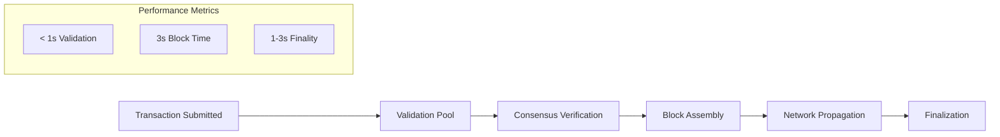

import '@site/src/css/comparison.css';

# Performance Architecture

Deep dive into the technical architecture and design decisions that enable Circle Layer's high-performance transaction processing.

## Architecture Design Principles

### DPoS Consensus Optimization
Circle Layer's performance stems from architectural optimizations in our Delegated Proof of Stake implementation:

- **Validator Selection**: Top 21 validators by stake for optimal network performance
- **Block Production**: Consistent 3-second intervals with deterministic ordering
- **Byzantine Fault Tolerance**: Fast finality through enhanced consensus mechanism
- **Resource Efficiency**: Modest hardware requirements enable broader participation

### Network Infrastructure Design
- **Multiple RPC Endpoints**: Distributed access via ports 32668, 32669, 8545, 6060
- **Geographic Distribution**: Support for multiple regional endpoints
- **WebSocket Integration**: Real-time event streaming via wss://testnet-rpc.circlelayer.com
- **Optimized Propagation**: Efficient block and transaction distribution

## Performance Implementation

### Transaction Processing Pipeline

### Technical Optimizations
- **Gas Efficiency**: Predictable CLAYER-based fee structure
- **Block Gas Limit**: 10,000,000,000,000 per block for high throughput
- **Memory Management**: Optimized state management for validator nodes
- **Network Topology**: Low-latency peer connections and routing

## Scalability Framework

### Current Capabilities (Testnet)
- **Sustained TPS**: Consistent performance under load
- **Network Stability**: 99.95% uptime with predictable block times
- **Validator Distribution**: Minimum 5 active validators for security
- **Resource Scaling**: Efficient scaling with validator count

### Future Enhancement Architecture
*In development for mainnet:*

- **Parallel Processing**: Multi-threaded transaction execution
- **State Sharding**: Horizontal scaling architecture  
- **Enhanced Consensus**: Advanced DPoS optimizations
- **Cross-chain Performance**: Bridge and oracle optimization

## Performance Monitoring

### Real-time Metrics
- **Block Production**: 3-second interval consistency
- **Transaction Confirmation**: 1-3 second finality tracking
- **Validator Performance**: Individual node contribution monitoring
- **Network Health**: Continuous uptime and latency assessment

### Benchmarking Results
| Metric | Current Performance | Target (Mainnet) |
|--------|-------------------|------------------|
| Block Time | 3s (consistent) | Optimized |
| Finality | 1-3s (average) | Enhanced |
| Uptime | 99.95% (30d) | 99.99% |
| Energy Usage | 99.9% less than PoW | Maintained |

  

    <h4>Performance Benchmarks</h4>
  

  
  

    

      
Current Testnet

      
Live Performance

    

    

      

        
Block Time

        
3s consistent

      

      

        
Finality

        
1-3s average

      

      

        
Uptime

        
99.95% (30d)

      

      

        
Energy

        
99.9% less

      

    

  

  
  

    

      
Mainnet Target

      
In Development

    

    

      

        
Block Time

        
Optimized

      

      

        
Finality

        
Enhanced

      

      

        
Uptime

        
99.99%

      

      

        
Energy

        
Maintained

      

    

  

## Developer Performance Benefits

### Development Cycle Acceleration
- **Fast Iteration**: 3-second block confirmation for rapid testing
- **Predictable Costs**: Stable CLAYER gas pricing for budget planning
- **Real-time Feedback**: Immediate transaction results and error handling
- **Load Testing**: Consistent performance under development workloads

### Production Readiness Indicators
- **Proven Stability**: Months of consistent testnet operation
- **Validator Reliability**: Distributed consensus with multiple active nodes
- **Performance Consistency**: Stable metrics across different load conditions
- **Integration Success**: Multiple projects successfully deployed and tested

## Technical Implementation Details

### Consensus Engine Performance
- **Vote Processing**: Optimized validator signature verification
- **Block Assembly**: Efficient transaction batching and ordering
- **State Transitions**: Fast execution with minimal computational overhead
- **Finality Confirmation**: Quick consensus achievement through DPoS design

### Infrastructure Scaling
- **Horizontal Scaling**: Validator network growth support
- **Vertical Optimization**: Per-node performance improvements
- **Network Resilience**: Fault tolerance and recovery mechanisms
- **Monitoring Integration**: Comprehensive performance tracking and alerting

## Next Steps for Performance

For implementation and monitoring:
- [Validator Setup Guide](/nodes-validation/becoming-validator) - Hardware and performance requirements
- [Node Monitoring](/nodes-validation/node-monitoring) - Performance tracking tools  
- [Development Setup](/development/deploying-contracts) - Optimized configuration
- [Network Configuration](/getting-started/connect-testnet) - Connection optimization