import Tabs from '@theme/Tabs';
import TabItem from '@theme/TabItem';
import StakingCalculator from '@site/src/components/StakingCalculator';
import '@site/src/css/pos-consensus.css';
import '@site/src/css/intro.css';

  
🌱 Energy Efficient

  <h1 className="hero-title">Delegated Proof of Stake Consensus Mechanism</h1>
  

    Circle Layer implements a cutting-edge Delegated Proof of Stake (DPoS) consensus mechanism that ensures network security, energy efficiency, and fast finality while maintaining true decentralization.
  

  
  

    

      
99.9%

      
Less Energy

    

    

      
1-3s

      
Finality

    

    

      
21

      
Max Validators

      
32

      
Min Stake (Testnet)

    

  

  

    

  

## 🌐 Consensus Overview

Circle Layer adopts **Delegated Proof of Stake (DPoS)** consensus mechanism with low transaction cost, low transaction latency, high transaction concurrency, and supports up to **21 validators**.

DPoS allows anyone to become a validator by staking specified coins. It also allows delegators to stake small amounts and to participate in network security. Any address can stake to an address that qualifies to become a validator, and after the validator's staking volume ranks in the top 21, it will become an active validator in the next epoch.

```mermaid
graph TB
    A[🗳️ Validator Selection] --> B[📦 Block Production]
    B --> C[✅ Consensus Process]
    C --> D[🎁 Reward Distribution]
    D --> A
    
    E[👥 Stakers] --> A
    F[💰 Stake Pool] --> A
    G[🔄 Epoch Timer] --> A
    
    B --> H[📋 Transaction Validation]
    B --> I[🔗 Block Assembly]
    
    C --> J[🔐 Byzantine Fault Tolerance]
    C --> K[⚡ Fast Finality]
    
    D --> L[💎 Validator Rewards]
    D --> M[🏆 Delegator Rewards]
```

### 🔥 Key Benefits

  

    
🌱

    <h4>Energy Efficiency</h4>
    

      99.9%
      Less Energy
    

    
Consumes 99.9% less energy compared to Proof of Work consensus mechanisms

    

      

        PoW
        

        100 TWh/year
      

      

        PoS
        

        0.1 TWh/year
      

    

  

  

    
🛡️

    <h4>Enhanced Security</h4>
    

      67%+
      Attack Threshold
    

    
Economic security through stake-based validation and punishment mechanisms

     

      
🔒 Cryptographic Signatures

      
⚔️ punishment mechanisms

      
🯠Stake Requirements

    

  

  

    
⚡

    <h4>Faster Finality</h4>
    

      1-3s
      Finality Time
    

    
Achieve transaction finality in seconds, not minutes or hours

          

        

          Circle Layer
          1-3s
        

      

        Ethereum
        12-19s
      

      

        Bitcoin
        60min+
      

    

  

  

    
🌐

    <h4>True Decentralization</h4>
    

      1000+
      Validators
    

    
Low barriers to entry reduce centralization risks and promote participation

    

      

        100,000 CLAYER
        Min Stake
      

      

        24/7
        Uptime Req.
      

      

        5%
        Hardware Cost
      

    

  

## 🔄 How Consensus Works

<Tabs>
  <TabItem value="selection" label="🎯 Validator Selection">
    

      <h3>Validator Selection Process</h3>
      
      

        

          
💰

          

            <h5>Stake Requirement</h5>
            
Validators must stake a minimum of <strong>32 CLAYER tokens (testnet)</strong> or <strong>100,000 CLAYER tokens (mainnet)</strong> to participate in consensus

            

              

                Testnet Min Stake:
                32 CLAYER
              

              

                Mainnet Min Stake:
                100,000 CLAYER
              

              

                Lock Period:
                7 days
              

            

          

        

        

          
🏆

          

            <h5>Top 21 Selection</h5>
            
Validators are selected based on their staking amount. The top 21 validators by stake become active validators in the next epoch.

          

        

        

          
⏰

          

            <h5>Epoch-Based Rotation</h5>
            
Validator sets are updated at the end of each epoch (200 blocks). This ensures dynamic participation based on current stake rankings.

            

              

                Epoch Duration:
                200 blocks
              

              

                Block Time:
                3 seconds
              

            

          

        

      

    

  </TabItem>

  <TabItem value="production" label="📦 Block Production">
    

      <h3>Block Production Process</h3>
      
      

        

          
🔄

          

            <h5>Round-Robin Block Production</h5>
            
All active validators are ordered according to predefined rules and take turns to produce blocks.

          

        

        

          
⚠️

          

            <h5>Fallback Mechanism</h5>
            
If a validator fails to produce a block in time during its turn, active validators who have not been involved in the past n/2 blocks will randomly perform block production.

          

        

        

          
🛡️

          

            <h5>Network Security</h5>
            
At least n/2+1 active validators must work properly to ensure the proper operation of the blockchain.

          

        

      

    

  </TabItem>

  <TabItem value="rewards" label="🎁 Reward Distribution">
    

      <h3>Reward Distribution System</h3>
      
      

        

          <h5>Gas Fee Distribution</h5>
          
All transaction fees paid in CLAYER are collected and distributed to validators based on their stake proportion.

        

          

            

              🤠Delegators
              45%
            

            

              

            

            

              Shared with token delegators
            

          

        

          <h5>Block Rewards</h5>
          
At the end of each block, the Validators contract is called and fees for all transactions in the block are distributed to active validators.

        

      

    

  </TabItem>
</Tabs>

## 🛡️ Security Features

  

    

      
⚔️

      <h4>Slashing Conditions</h4>
    

    

      
Validators face economic penalties for malicious behavior

      

        

          Double Signing
          5% Stake
        

        

          Nothing at Stake
          2% Stake
        

        

          Long Range Attack
          100% Stake
        

        

          Extended Downtime
          1% Stake
        

        

          Invalid Proposals
          0.5% Stake
        

      

    

  

  

    

      
🔄

      <h4>Validator Rotation</h4>
    

    

      
Regular rotation prevents centralization and censorship

      

        

          Rotation Period
          24 hours
        

        

          Selection Method
          VRF + Stake
        

        

          Max Consecutive
          3 blocks
        

      

    

  

  

    

      
🎯

      <h4>Stake Delegation</h4>
    

    

      
Token holders can delegate stake without giving up custody

      

        
✅ Non-custodial

        
✅ Liquid staking

        
✅ Governance rights

        
✅ Flexible unbonding

      

    

  

  

    

      
🎁

      <h4>Participation Incentives</h4>
    

    

      
Rewards encourage honest participation and network growth

      

        

          Block Rewards
          2 CLAYER/block
        

        

          Transaction Fees
          Variable
        

        

          Uptime Bonus
          +20%
        

      

    

  

## 🛡️ DPoS Punishment System

### Comprehensive Slashing Conditions

Circle Layer implements a sophisticated punishment system to maintain network integrity and security:

  

    <h4>💀 Critical Violations (Severe Penalties)</h4>
    

      

        

          Double Signing Attack
          5% Stake Slashed
        

        

          
Validator signs two conflicting blocks at the same height

          

            ⏱️ Detection: Immediate
            🔒 Jail Time: 30 days
            💰 Recovery: Requires re-staking
          

        

      

      

        

          Long Range Attack
          100% Stake Slashed
        

        

          
Attempting to reorganize the blockchain from an old state

          

            ⏱️ Detection: 24-48 hours
            🔒 Jail Time: Permanent
            💰 Recovery: Not possible
          

        

      

      

        

          Nothing at Stake
          2% Stake Slashed
        

        

          
Validator participates in multiple competing chains simultaneously

          

            ⏱️ Detection: 6-12 hours
            🔒 Jail Time: 14 days
            💰 Recovery: Partial re-staking
          

        

      

    

  

  

    <h4>⚠️ Performance Violations (Moderate Penalties)</h4>
    

      

        

          Extended Downtime
          1% Stake Slashed
        

        

          
Validator offline for more than 12 consecutive hours

          

            ⏱️ Detection: 12 hours
            🔒 Jail Time: 7 days
            💰 Recovery: Automatic after jail
          

        

      

      

        

          Invalid Block Proposals
          0.5% Stake Slashed
        

        

          
Proposing blocks with invalid transactions or format

          

            ⏱️ Detection: Immediate
            🔒 Jail Time: 3 days
            💰 Recovery: Automatic after jail
          

        

      

      

        

          Repeated Missed Proposals
          0.1% per incident
        

        

          
Missing 5+ consecutive block proposal opportunities

          

            ⏱️ Detection: 15 minutes
            🔒 Jail Time: 24 hours
            💰 Recovery: Warning system
          

        

      

    

  

### System Contracts for Validator Management

Circle Layer uses a comprehensive system of smart contracts to manage validator operations:

  

    <h4>🏛️ Core Validator Contracts</h4>
    
    

      

        <h5>ValidatorRegistry Contract</h5>
        Active
      

      

        

          <h6>Registration Functions</h6>
          <ul>
            <li><code>registerValidator()</code> - Register new validator with minimum stake</li>
            <li><code>updateValidatorInfo()</code> - Update validator metadata and commission</li>
            <li><code>deactivateValidator()</code> - Voluntarily exit from validator set</li>
          </ul>
        

        

          <h6>Status Management</h6>
          <ul>
            <li><code>getValidatorStatus()</code> - Query current validator state</li>
            <li><code>isValidatorActive()</code> - Check if validator is in active set</li>
            <li><code>getValidatorMetrics()</code> - Performance and uptime data</li>
          </ul>
        

      

    

    

      

        <h5>StakingManager Contract</h5>
        Active
      

      

        

          <h6>Staking Operations</h6>
          <ul>
            <li><code>stakeTokens(validatorAddress, amount)</code> - Delegate stake to validator</li>
            <li><code>unstakeTokens(validatorAddress, amount)</code> - Initiate unstaking process</li>
            <li><code>restakeRewards(validatorAddress)</code> - Compound staking rewards</li>
          </ul>
        

        

          <h6>Reward Distribution</h6>
          <ul>
            <li><code>claimRewards(validatorAddress)</code> - Claim accumulated rewards</li>
            <li><code>distributeRewards()</code> - Automated reward distribution</li>
            <li><code>calculateRewards(address)</code> - Preview pending rewards</li>
          </ul>
        

      

    

    

      

        <h5>SlashingManager Contract</h5>
        Active
      

      

        

          <h6>Slashing Operations</h6>
          <ul>
            <li><code>slashValidator(validator, evidence, penalty)</code> - Execute slashing</li>
            <li><code>jailValidator(validator, duration)</code> - Jail validator temporarily</li>
            <li><code>submitEvidence(evidence)</code> - Submit slashing evidence</li>
          </ul>
        

        

          <h6>Recovery Functions</h6>
          <ul>
            <li><code>unjailValidator(validator)</code> - Release from jail after term</li>
            <li><code>appealSlashing(validator, appeal)</code> - Appeal slashing decision</li>
            <li><code>getSlashingHistory(validator)</code> - Query slashing record</li>
          </ul>
        

      

    

  

  

    <h4>⚖️ Governance & Dispute Contracts</h4>
    
    

      

        <h5>DisputeResolution Contract</h5>
        Development
      

      

        
Handles appeals and disputes related to validator slashing and punishment decisions.

        

          📋 Evidence submission
          🗳️ Community voting
          ⚖️ Arbitration system
          💰 Appeal bonds
        

      

    

    

      

        <h5>ParameterGovernance Contract</h5>
        Development
      

      

        
Manages changes to staking parameters, slashing conditions, and network settings.

        

          ğŸ›ï¸ Parameter updates
          ⏰ Time-locked changes
          🔠Multi-sig approval
          📊 Impact analysis
        

      

    

  

### Detailed Staking & Unstaking Mechanics

  

    <h4>🔐 Staking Process</h4>
    
    

      

        
1

        

          <h5>Stake Preparation</h5>
          <ul>
            <li>Minimum stake: 32 CLAYER (testnet) / 100,000 CLAYER (mainnet)</li>
            <li>Wallet balance verification</li>
            <li>Gas fee preparation (≈0.01 CLAYER for staking transaction)</li>
            <li>Validator selection and due diligence</li>
          </ul>
          
⏱️ Duration: Immediate

        

      

      

        
2

        

          <h5>Transaction Execution</h5>
          <ul>
            <li>Call <code>stakeTokens(validatorAddress, amount)</code></li>
            <li>Tokens transferred to staking contract</li>
            <li>Staking record created with timestamp</li>
            <li>Validator delegation pool updated</li>
          </ul>
          
⏱️ Duration: 3-9 seconds (1-3 blocks)

        

      

      

        
3

        

          <h5>Activation Period</h5>
          <ul>
            <li>Staking amount enters "pending" state</li>
            <li>Becomes active in next epoch (≈24 hours)</li>
            <li>Starts earning rewards after activation</li>
            <li>Delegation shows in validator's total stake</li>
          </ul>
          
⏱️ Duration: Up to 24 hours

        

      

      

        
4

        

          <h5>Active Staking</h5>
          <ul>
            <li>Rewards accrue automatically per block</li>
            <li>Can claim rewards without unstaking</li>
            <li>Voting power proportional to stake</li>
            <li>Subject to slashing if validator misbehaves</li>
          </ul>
          
⏱️ Duration: Ongoing

        

      

    

  

  

    <h4>🔓 Unstaking Process</h4>
    
    

      

        
1

        

          <h5>Unstaking Initiation</h5>
          <ul>
            <li>Call <code>unstakeTokens(validatorAddress, amount)</code></li>
            <li>Specify amount to unstake (minimum 1 CLAYER)</li>
            <li>Tokens enter "unbonding" state immediately</li>
            <li>Stop earning rewards from this block</li>
          </ul>
          
⏱️ Duration: 3-9 seconds (1-3 blocks)

        

      

      

        
2

        

          <h5>Unbonding Period</h5>
          <ul>
            <li>Mandatory waiting period: <strong>21 days</strong></li>
            <li>Tokens locked and cannot be transferred</li>
            <li>Still subject to slashing if validator misbehaves</li>
            <li>No rewards earned during unbonding</li>
          </ul>
          
⏱️ Duration: 21 days (518,400 blocks)

        

      

      

        
3

        

          <h5>Release & Withdrawal</h5>
          <ul>
            <li>Automatic release after 21 days</li>
            <li>Tokens become transferable</li>
            <li>Can be withdrawn to wallet or re-staked</li>
            <li>No longer subject to slashing</li>
          </ul>
          
⏱️ Duration: Immediate after unbonding

        

      

    

  

  

    <h4>⚡ Emergency Mechanisms</h4>
    
    

      

        <h5>🚨 Emergency Unstaking</h5>
        
Available during severe validator misconduct or network emergencies

        

          ⏱️ Reduced unbonding: 7 days
          💰 Emergency fee: 0.5% of stake
          🔒 Governance approval required
        

      

      

        <h5>🛡️ Validator Jailing Protection</h5>
        
Automatic unstaking triggered when validator is jailed for critical violations

        

          ⏱️ Automatic trigger: During jailing
          💰 No additional fees
          🔒 Normal 21-day unbonding
        

      

      

        <h5>🔄 Validator Migration</h5>
        
Transfer stake between validators without unbonding period

        

          ⏱️ Instant transfer
          💰 Migration fee: 0.1% of stake
          🔒 Once per month limit
        

      

    

  

### Advanced Slashing Protections

  <h4>🛡️ Delegator Protections</h4>
  
  

    

      <h5>📊 Graduated Slashing</h5>
      
Slashing penalties applied gradually to minimize delegator impact:

      <ul>
        <li>First offense: 50% of total penalty</li>
        <li>Second offense: 75% of total penalty</li>
        <li>Third offense: 100% of total penalty</li>
        <li>Grace period: 90 days between offense resets</li>
      </ul>
    

    

      <h5>⚠️ Early Warning System</h5>
      
Automated notifications for delegators when validators show concerning patterns:

      <ul>
        <li>Uptime drops below 95%</li>
        <li>Missed block proposals exceed threshold</li>
        <li>Commission rate changes</li>
        <li>Abnormal behavior detected</li>
      </ul>
    

    

      <h5>🔄 Auto-Migration Options</h5>
      
Smart contract features to protect delegator interests:

      <ul>
        <li>Auto-unstake on critical violations</li>
        <li>Automatic re-delegation to backup validators</li>
        <li>Insurance pool for slashing compensation</li>
        <li>Community-governed protection mechanisms</li>
      </ul>
    

  

  

    <h3>🚀 Ready to Participate?</h3>
    
Circle Layer's advanced DPoS system with comprehensive punishment mechanisms ensures network security while protecting legitimate participants. Our detailed staking and slashing systems provide clear rules and fair protections for all network participants.

    

      <button className="action-btn primary">Start Staking</button>
      <button className="action-btn secondary">Learn More</button>
      <button className="action-btn tertiary">View Validators</button>
    

  

