import Tabs from '@theme/Tabs';
import TabItem from '@theme/TabItem';
import StakingCalculator from '@site/src/components/StakingCalculator';
import '@site/src/css/pos-consensus.css';
import '@site/src/css/intro.css';

  
🌱 Energy Efficient

  <h1 className="hero-title">Proof of Stake Consensus Mechanism</h1>
  

    Circle Layer implements a cutting-edge Delegated Proof of Stake (DPoS) consensus mechanism that ensures network security, energy efficiency, and fast finality while maintaining true decentralization.
  

  
  

    

      
99.9%

      
Less Energy

    

    

      
1-3s

      
Finality

    

    

      
32

      
Min Stake (Testnet)

    

  

  

    

  

## 🌐 Consensus Overview

```mermaid
graph TB
    A[🗳️ Validator Selection] --> B[📦 Block Production]
    B --> C[✅ Consensus Process]
    C --> D[🎁 Reward Distribution]
    D --> A
    
    E[👥 Delegators] --> A
    F[💰 Stake Pool] --> A
    G[🔄 Rotation Timer] --> A
    
    B --> H[📋 Transaction Validation]
    B --> I[🔗 Block Assembly]
    
    C --> J[🔐 Byzantine Fault Tolerance]
    C --> K[⚡ Fast Finality]
    
    D --> L[💎 Validator Rewards]
    D --> M[🏆 Delegator Rewards]
```

### 🔥 Key Benefits

  

    
🌱

    <h4>Energy Efficiency</h4>
    

      99.9%
      Less Energy
    

    
Consumes 99.9% less energy compared to Proof of Work consensus mechanisms

    

      

        PoW
        

        100 TWh/year
      

      

        PoS
        

        0.1 TWh/year
      

    

  

  

    
🛡️

    <h4>Enhanced Security</h4>
    

      67%+
      Attack Threshold
    

    
Economic security through stake-based validation and slashing conditions

    

      
🔒 Cryptographic Signatures

      
⚔️ Slashing Penalties

      
🎯 Stake Requirements

      
🔄 Validator Rotation

    

  

  

    
⚡

    <h4>Faster Finality</h4>
    

      1-3s
      Finality Time
    

    
Achieve transaction finality in seconds, not minutes or hours

          

        

          Circle Layer
          1-3s
        

      

        Ethereum
        12-19s
      

      

        Bitcoin
        60min+
      

    

  

  

    
🌐

    <h4>True Decentralization</h4>
    

      1000+
      Validators
    

    
Low barriers to entry reduce centralization risks and promote participation

    

      

        32 CLAYER
        Min Stake
      

      

        24/7
        Uptime Req.
      

      

        0%
        Hardware Cost
      

    

  

## 🔄 How Consensus Works

<Tabs>
  <TabItem value="selection" label="🎯 Validator Selection">
    

      <h3>Validator Selection Process</h3>
      
      

        

          
💰

          

            <h5>Stake Requirement</h5>
            
Validators must stake a minimum of <strong>32 CLAYER tokens (testnet)</strong> or <strong>100,000 CLAYER tokens (mainnet)</strong> to participate in consensus

            

              

                Testnet Min Stake:
                32 CLAYER
              

              

                Mainnet Min Stake:
                100,000 CLAYER
              

              

                Lock Period:
                7 days
              

            

          

        

        

          
🎲

          

            <h5>Random Selection</h5>
            
Validators are chosen using verifiable random function (VRF) weighted by stake amount

            

              

                <h6>Selection Probability</h6>
                <code>P = (Validator_Stake / Total_Stake) × Randomness_Factor</code>
              

            

          

        

        

          
⏰

          

            <h5>Time Slots</h5>
            
Selected validators are assigned specific time slots for block production

            

              

                Slot 1
                Validator A
              

              

                Slot 2
                Validator B
              

              

                Slot 3
                Validator C
              

            

          

        

      

      

        <h4>Current Validator Network</h4>
        

          

            
127

            
Active Validators

            
+12 this week

          

          

            
15,423

            
Total Staked CLAYER

            
+892 this week

          

          

            
99.95%

            
Network Uptime

            
Excellent

          

          

            
2.1s

            
Avg Block Time

            
Consistent

          

        

      

    

  </TabItem>

  <TabItem value="production" label="📦 Block Production">
    

      <h3>Block Production Workflow</h3>
      
      

        

          
1

          

            <h5>Transaction Collection</h5>
            
Validator collects pending transactions from mempool

            

              📋 2,847 pending transactions
              ⏱️ 0.2s collection time
            

          

        

        

          
2

          

            <h5>Transaction Validation</h5>
            
Verify signatures, balances, and smart contract execution

            

              

                ✅ Signature Valid
                2,834 txns
              

              

                ❌ Invalid
                13 txns
              

            

          

        

        

          
3

          

            <h5>Block Assembly</h5>
            
Package validated transactions into a new block

            

              

                Block #1,234,567
                2,834 transactions
                1.2 MB size
              

            

          

        

        

          
4

          

            <h5>Block Proposal</h5>
            
Broadcast block to network for validation

            

              📡 Broadcasted to 127 validators
              🔍 Awaiting consensus
            

          

        

      

      

        <h4>Production Performance</h4>
        

          

            

              Block Production Rate
              Excellent
            

            

              

            

            

              98% successful blocks
              2.1s avg time
            

          

          

            

              Transaction Throughput
              High
            

            

              

            

            

              3,247 TPS
              85% capacity
            

          

          

            

              Network Latency
              Low
            

            

              

            

            

              47ms avg
              Global network
            

          

        

      

    

  </TabItem>

  <TabItem value="consensus" label="✅ Consensus Process">
    

      <h3>Byzantine Fault Tolerance</h3>
      
      

        

          

            

              🟢
              <label>Honest</label>
            

            

              🟢
              <label>Honest</label>
            

            

              🟢
              <label>Honest</label>
            

            

              🟢
              <label>Honest</label>
            

            

              🔴
              <label>Byzantine</label>
            

          

          

            <h5>Consensus Achieved ✅</h5>
            
4/5 honest validators (80%) > 2/3 threshold (67%)

          

        

      

      

        <h4>Three-Phase Consensus</h4>
        

          

            
📝

            <h5>1. Propose</h5>
            
Selected validator proposes a new block

            

              
⏱️ Duration: 0.5s

              
🎯 Success Rate: 99.95%

            

          

          

            
🗳️

            <h5>2. Prevote</h5>
            
Validators vote on the proposed block

            

              
⏱️ Duration: 0.7s

              
🎯 Threshold: 67%+

            

          

          

            
✅

            <h5>3. Precommit</h5>
            
Final commitment to add block to chain

            

              
⏱️ Duration: 0.8s

              
🎯 Finality: Immediate

            

          

        

      

      

        <h4>Safety Guarantees</h4>
        

          

            
🔒

            

              <h6>Fork Prevention</h6>
              
Two valid blocks cannot be finalized at the same height

            

          

          

            
🎯

            

              <h6>Liveness Guarantee</h6>
              
Network continues to make progress even with up to 33% faulty validators

            

          

          

            
⚔️

            

              <h6>Slashing Conditions</h6>
              
Validators lose stake for double-signing or other malicious behavior

            

          

        

      

    

  </TabItem>

  <TabItem value="rewards" label="🎁 Rewards & Staking">
    

      <h3>Staking Rewards & Economics</h3>
      
      <StakingCalculator />

      

        <h4>📊 Reward Distribution & Revenue Sharing</h4>
        

          

            

              👥 Validators
              30%
            

            

              

            

            

              For block production and validation
            

          

          

            

              🤝 Delegators
              45%
            

            

              

            

            

              Shared with token delegators
            

          

          

            

              🔥 Burn
              25%
            

            

              

            

            

              Burned (stops at 1M CLAYER threshold)
            

          

        

        

          <h5>💰 Revenue Sharing Breakdown</h5>
          

            

              <h6>🔥 Transaction Fees</h6>
              <ul>
                <li>Validators: 30% of transaction fees</li>
                <li>Delegators: 45% of transaction fees</li>
                <li>Burn Mechanism: 25% (max 1M CLAYER threshold)</li>
                <li>Expected Fee Revenue: $50K-500K daily at peak usage</li>
              </ul>
            

            

              <h6>🎁 Block Rewards</h6>
              <ul>
                <li>Base Block Reward: 2 CLAYER per block</li>
                <li>Uptime Bonus: +20% for 99%+ uptime</li>
                <li>Performance Bonus: +15% for top 25% validators</li>
                <li>Expected Block Revenue: 8,640-12,000 CLAYER daily</li>
              </ul>
            

            

              <h6>📈 Delegation Commission</h6>
              <ul>
                <li>Validator Commission: 5-15% from delegator rewards</li>
                <li>Competitive Commission Range: Market-driven rates</li>
                <li>Expected Delegation Revenue: 2-8% annual from delegated stake</li>
                <li>Total Delegated Value: $500K-5M per validator at scale</li>
              </ul>
            

          

          

            <h5>💎 Expected Validator Revenue (Annual)</h5>
            

              

                <h6>🟢 Conservative (Low Network Usage)</h6>
                

                  Block Rewards:
                  12,000-18,000 CLAYER
                

                

                  Transaction Fees:
                  5,000-15,000 CLAYER
                

                

                  Delegation Commission:
                  8,000-25,000 CLAYER
                

                

                  Total Annual Revenue:
                  25,000-58,000 CLAYER
                

                

                  USD Equivalent:
                  $25K-58K (at $1/CLAYER)
                

              

              

                <h6>🟡 Moderate (Medium Network Usage)</h6>
                

                  Block Rewards:
                  18,000-28,000 CLAYER
                

                

                  Transaction Fees:
                  25,000-75,000 CLAYER
                

                

                  Delegation Commission:
                  40,000-120,000 CLAYER
                

                

                  Total Annual Revenue:
                  83,000-223,000 CLAYER
                

                

                  USD Equivalent:
                  $83K-223K (at $1/CLAYER)
                

              

              

                <h6>🔴 Optimistic (High Network Usage)</h6>
                

                  Block Rewards:
                  28,000-42,000 CLAYER
                

                

                  Transaction Fees:
                  100,000-500,000 CLAYER
                

                

                  Delegation Commission:
                  200,000-800,000 CLAYER
                

                

                  Total Annual Revenue:
                  328,000-1,342,000 CLAYER
                

                

                  USD Equivalent:
                  $328K-1.34M (at $1/CLAYER)
                

              

            

          

          

            <h5>📊 Revenue Factors</h5>
            

              

                🔥 Network Activity
                
Higher transaction volume = more fee revenue

              

              

                ⚡ Validator Performance
                
Better uptime and performance = bonus rewards

              

              

                🤝 Delegation Amount
                
More delegated stake = higher commission earnings

              

              

                💰 Token Price
                
CLAYER price appreciation increases USD value

              

            

          

        

      

      

        <h4>🎯 Staking Options</h4>
        

          

            

              
👑

              <h5>Run Validator</h5>
            

            

              

                Min Stake:
                100,000 CLAYER
              

              

                Hardware:
                Cloud/VPS
              

              

                Uptime:
                99%+
              

              

                Reward Rate:
                15-20% APY
              

            

            <button className="option-btn">Start Validating</button>
          

          

            

              
🤝

              <h5>Delegate Stake</h5>
            

            

              

                Min Stake:
                32 CLAYER
              

              

                Hardware:
                None
              

              

                Maintenance:
                None
              

              

                Reward Rate:
                10-15% APY
              

            

            <button className="option-btn">Delegate Now</button>
          

          

            

              
🏊

              <h5>Staking Pools</h5>
            

            

              

                Min Stake:
                0.1 CLAYER
              

              

                Liquidity:
                High
              

              

                Risk:
                Low
              

              

                Reward Rate:
                8-12% APY
              

            

            <button className="option-btn">Join Pool</button>
          

        

      

    

  </TabItem>
</Tabs>

## 🛡️ Security Features

  

    

      
⚔️

      <h4>Slashing Conditions</h4>
    

    

      
Validators face economic penalties for malicious behavior

      

        

          Double Signing
          5% Stake
        

        

          Nothing at Stake
          2% Stake
        

        

          Long Range Attack
          100% Stake
        

      

    

  

  

    

      
🔄

      <h4>Validator Rotation</h4>
    

    

      
Regular rotation prevents centralization and censorship

      

        

          Rotation Period
          24 hours
        

        

          Selection Method
          VRF + Stake
        

        

          Max Consecutive
          3 blocks
        

      

    

  

  

    

      
🎯

      <h4>Stake Delegation</h4>
    

    

      
Token holders can delegate stake without giving up custody

      

        
✅ Non-custodial

        
✅ Liquid staking

        
✅ Governance rights

        
✅ Flexible unbonding

      

    

  

  

    

      
🎁

      <h4>Participation Incentives</h4>
    

    

      
Rewards encourage honest participation and network growth

      

        

          Block Rewards
          2 CLAYER/block
        

        

          Transaction Fees
          Variable
        

        

          Uptime Bonus
          +20%
        

      

    

  

  

    <h3>🚀 Ready to Participate?</h3>
    
Circle Layer's Proof of Stake consensus offers multiple ways to earn rewards while securing the network. Whether you want to run a validator, delegate your stake, or join a staking pool, there's an option that fits your needs and risk tolerance.

    

      <button className="action-btn primary">Start Staking</button>
      <button className="action-btn secondary">Learn More</button>
      <button className="action-btn tertiary">View Validators</button>
    

  

