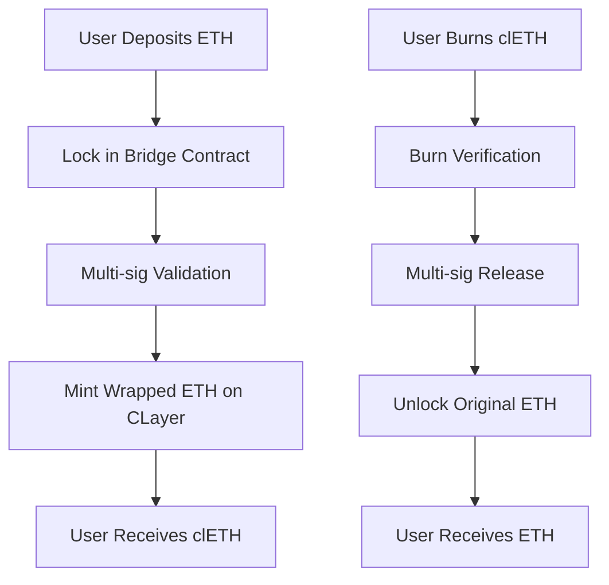

# Cross-Chain Bridge

## Overview

CLayer implements a comprehensive cross-chain bridge infrastructure that enables seamless asset transfer between CLayer Blockchain and other major blockchain networks. The bridge uses a secure lock-and-mint mechanism to ensure asset safety and maintain liquidity across chains.

## Bridge Architecture

### Asset Mapping System
CLayer's cross-chain bridge supports mapping of major crypto assets to the CLayer ecosystem:

- **ETH (Ethereum)**: Native Ethereum tokens
- **BNB (Binance Smart Chain)**: BSC native and BEP-20 tokens  
- **Stable Coins**: USDC, USDT, DAI, and other major stablecoins
- **Wrapped Bitcoin**: wBTC and other Bitcoin representations
- **Custom Tokens**: ERC-20 and compatible token standards

### Lock-and-Mint Mechanism
The bridge operates using a secure lock-and-mint protocol:

1. **Asset Locking**: Original tokens are locked in secure smart contracts on the source chain
2. **Verification**: Multi-signature validation confirms the lock transaction
3. **Minting**: Corresponding amount of tokens are minted on CLayer Blockchain
4. **Redemption**: Users can burn CLayer tokens to unlock original assets



## Supported Assets

### Primary Bridge Pairs
- **CLAYER/ETH**: Direct bridging between native tokens
- **CLAYER/USDC**: Stable coin integration for DeFi
- **CLAYER/BNB**: Binance Smart Chain connectivity
- **CLAYER/USDT**: Additional stable coin support

### Asset Categories

#### 1. Native Tokens
- **Ethereum (ETH)**: 1:1 mapping to clETH
- **BNB**: 1:1 mapping to clBNB
- **CLAYER**: Native CLayer token

#### 2. Stable Coins
- **USDC**: USD Coin bridging
- **USDT**: Tether bridging  
- **DAI**: MakerDAO stable coin
- **BUSD**: Binance USD

#### 3. Wrapped Assets
- **wBTC**: Wrapped Bitcoin
- **wETH**: Wrapped Ethereum
- **Custom Wrapped Tokens**: Project-specific wrapped assets

## Bridge Security

### Multi-Signature Validation
- **Validator Consensus**: 5-of-7 multi-signature requirement
- **Time Delays**: 24-hour delay for large transfers (>$100,000)
- **Emergency Pause**: Circuit breaker functionality for security incidents
- **Audit Trail**: Complete transaction history and verification

### Security Features
- **Real-time Monitoring**: AI-powered anomaly detection
- **Rate Limiting**: Protection against bulk transfer attacks
- **Whitelist Support**: Optional whitelisting for institutional users
- **Insurance Integration**: Coverage for bridge-related losses

## Token-Peg Application Process

### Application Requirements
To apply for token bridging support, projects must follow this process:

1. **Initial Application**
   - Contact: support@clayer.io
   - Submit project details and technical specifications
   - Provide tokenomics and security audit information

2. **Technical Review**
   - Smart contract audit verification
   - Token economics analysis
   - Security assessment
   - Compliance check

3. **Bridge Contract Deployment**
   - Custom bridge contract development
   - Multi-signature setup
   - Security testing and validation
   - Testnet deployment and testing

4. **Production Launch**
   - Mainnet bridge deployment
   - Liquidity bootstrapping
   - Community announcement
   - Monitoring and support

### Application Process Overview

The Crosschain Bridge lets users to exchange the assets from other blockchains to our blockchain.

**The process is:**

1. **Submit application**
   - Email: support@clayer.io
   
2. **Deploy token contract**

3. **Testing**

4. **Online**

### Application Timeline
- **Initial Review**: 2-3 weeks
- **Technical Development**: 4-6 weeks
- **Testing Phase**: 2-3 weeks
- **Production Deployment**: 1-2 weeks

## Decentralized Cross-Chain Solutions

### Community Development
CLayer encourages the development of decentralized cross-chain solutions:

- **Open Source Bridges**: Community-developed bridge protocols
- **Decentralized Validators**: Permissionless validator participation
- **Cross-Chain DAOs**: Governance across multiple chains
- **Interoperability Standards**: Development of universal standards

### Developer Incentives
- **Grant Programs**: Funding for cross-chain development
- **Technical Support**: Core team assistance for bridge projects
- **Security Resources**: Audit support and security reviews
- **Community Recognition**: Developer showcase and promotion

## Bridge Usage

### User Guide

#### Bridging Assets to CLayer
1. **Connect Wallet**: Connect MetaMask or compatible wallet
2. **Select Asset**: Choose asset to bridge (ETH, BNB, USDC, etc.)
3. **Enter Amount**: Specify amount to bridge
4. **Confirm Transaction**: Sign the lock transaction
5. **Wait for Minting**: Receive wrapped tokens on CLayer

#### Bridging Assets from CLayer
1. **Select Wrapped Asset**: Choose asset to bridge back
2. **Enter Amount**: Specify amount to unlock
3. **Initiate Burn**: Burn wrapped tokens on CLayer
4. **Wait for Unlock**: Original tokens released on source chain

### Integration Examples

#### Web3.js Integration
```javascript
const CircleLayerBridge = require('@clayer/bridge-sdk');

// Initialize bridge
const bridge = new CircleLayerBridge({
  rpcUrl: 'https://testnet-rpc.clayer.io',
  contractAddress: '0x...' // Bridge contract address
});

// Bridge ETH to CLayer
async function bridgeETH(amount, userAddress) {
  const tx = await bridge.lockETH({
    amount: amount,
    recipient: userAddress,
    sourceChain: 'ethereum'
  });
  
  return await tx.wait();
}

// Bridge back to Ethereum
async function bridgeBack(amount, userAddress) {
  const tx = await bridge.burnWrappedETH({
    amount: amount,
    recipient: userAddress,
    targetChain: 'ethereum'
  });
  
  return await tx.wait();
}
```

#### React Integration
```jsx
import { useBridge } from '@clayer/bridge-sdk';

function BridgeComponent() {
  const { bridge, bridgeETH, getBalances } = useBridge();
  const [amount, setAmount] = useState('');
  
  const handleBridge = async () => {
    try {
      const tx = await bridgeETH(amount);
      console.log('Bridge transaction:', tx.hash);
    } catch (error) {
      console.error('Bridge failed:', error);
    }
  };
  
  return (
    <div>
      <input 
        value={amount}
        onChange={(e) => setAmount(e.target.value)}
        placeholder="Amount to bridge"
      />
      <button onClick={handleBridge}>
        Bridge to CLayer
      </button>
    </div>
  );
}
```

## Bridge Monitoring

### Real-time Status
- **Bridge Health**: Live status monitoring
- **Transaction Queue**: Pending bridge transactions
- **Liquidity Levels**: Available liquidity on both sides
- **Performance Metrics**: Bridge speed and success rates

### Analytics Dashboard
- **Volume Statistics**: Daily/weekly/monthly bridge volume
- **Asset Distribution**: Most bridged assets
- **User Analytics**: Bridge adoption metrics
- **Security Incidents**: Security event tracking

## Future Development

### Planned Enhancements
- **Additional Chains**: Polygon, Arbitrum, Avalanche support
- **Faster Finality**: Reduced bridge confirmation times
- **Lower Fees**: Optimized gas costs for bridging
- **Mobile Integration**: Native mobile wallet bridge support

### Community Contributions
- **Open Source**: Bridge contracts and SDK open sourced
- **Developer Community**: Active developer engagement
- **Security Bounties**: Ongoing security research incentives
- **Protocol Improvements**: Community-driven enhancements

## Resources

### Documentation
- **Technical Specs**: Bridge architecture documentation
- **API Reference**: Complete SDK documentation
- **Security Audits**: Published security audit reports
- **Integration Guides**: Step-by-step integration tutorials

### Support
- **Developer Telegram**: Real-time developer support
- **Technical Support**: support@clayer.io
- **Security Issues**: admin@clayer.io
- **Bug Reports**: GitHub issues and bug tracking 