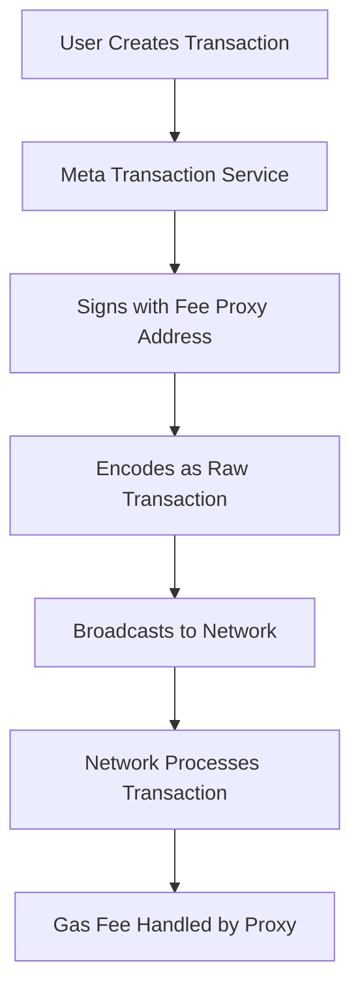

# Meta Transactions

A meta-transaction is essentially an operation that fulfills a fee payment in proxy. `Address1` gives the transaction to be sent to `Address2`. And `Address2` signs the information related to the fee deduction and places it in the `data` data segment of the transaction. The transaction is then broadcast and the blockchain processes the transaction according to the rules.

## Overview

Meta transactions allow users to have their transaction fees paid by a third party, enabling:
- **Gas Fee Reduction**: Lower effective costs for CLAYER holders
- **Improved UX**: Users can transact without holding CLAYER for gas
- **Fee Subsidies**: Official subsidy programs based on token holdings

## How Meta Transactions Work



## Building Meta Transactions

### Implementation Steps

1. **Obtain Raw Transaction**: Get the original `rawTransaction` information
2. **Parse Transaction**: Extract fields like `nonce`, `gasPrice`, `gasLimit`, `from`, `to`, `value`, `data`
3. **RLP Encoding**: Encode transaction data with fee discount percentage

### Code Example (Java)

```java
List<RlpType> result = new ArrayList();
result.add(RlpString.create(nonce));
result.add(RlpString.create(gasPrice));
result.add(RlpString.create(gasLimit));
result.add(RlpString.create(receiveAddress));
result.add(RlpString.create(value));
result.add(RlpString.create(data));
result.add(RlpString.create(sendAddress));
result.add(RlpString.create(feePercent));
result.add(RlpString.create(blockNumber));
result.add(RlpString.create(chainId));

RlpList rlpList = new RlpList(result);
this.rlpEncodeData = RlpEncoder.encode(rlpList);
```

4. **Sign Data**: Sign the encoded data with the fee proxy address
5. **Replace Data Field**: Update original transaction with signed data
6. **Broadcast**: Send the modified `rawTransaction` to the blockchain

## Official Meta Transaction Service

CLayer Blockchain officially provides a meta transaction service with fee subsidies based on the caller's `CLAYER` holdings.

### Service Details

- **API Endpoint**: (not live yet) `https://meta-mainnet.clayer.io`
- **Subsidy Expiration**: 1 day (28,800 blocks)
- **Daily Limit**: Maximum 5 subsidized transactions per account per day

### Fee Subsidy Tiers

| CLAYER Holdings | Subsidy Rate | Daily Limit |
|----------------|--------------|-------------|
| 1,000+ CLAYER | 10% discount | 5 transactions |
| 5,000+ CLAYER | 25% discount | 5 transactions |
| 10,000+ CLAYER | 50% discount | 5 transactions |
| 50,000+ CLAYER | 75% discount | 5 transactions |

### API Endpoints

#### Calculate Subsidy Rate

**POST** `/meta/fee`

```json
{
    "from": "0x0000000000000000000000000000000000000000",
    "to": "0x0000000000000000000000000000000000000001", 
    "value": "1",
    "nonce": "0",
    "data": "0x0"
}
```

**Response:**
```json
{
   "status": 1,
   "message": "success",
   "data": 0
}
```

#### Sign and Broadcast Transaction

**POST** `/meta/tx`

```json
{
    "raw": "0xdddd"
}
```

**Response:**
```json
{
   "status": 1,
   "message": "success", 
   "data": "0x0000000000"
}
```

## Error Handling

### Common Issues

#### Invalid Fee Percentage
```
invalid meta transaction FeePercent need 0-10000. Found:100001
```
**Solution**: Ensure fee percentage is between 0-10000 (0-100%)

#### Expired Meta Transaction
```
err: expired meta transaction. current:2083222, need execute before 2075609
```
**Solution**: Meta transactions expire after 1 day. Create a new meta transaction.

### Troubleshooting Steps

1. **Check Fee Range**: Verify `feePercent` is within 0-10000
2. **Verify Expiration**: Ensure transaction is submitted within 28,800 blocks
3. **Account Limits**: Confirm daily transaction limit not exceeded
4. **Balance Check**: Verify sufficient CLAYER holdings for subsidy tier

## Integration Examples

### Web3.js Integration

```javascript
// Calculate subsidy rate
async function calculateSubsidy(txParams) {
    const response = await fetch('https://meta-mainnet.clayer.io/meta/fee', {
        method: 'POST',
        headers: { 'Content-Type': 'application/json' },
        body: JSON.stringify(txParams)
    });
    return response.json();
}

// Submit meta transaction
async function submitMetaTransaction(signedTx) {
    const response = await fetch('https://meta-mainnet.clayer.io/meta/tx', {
        method: 'POST',
        headers: { 'Content-Type': 'application/json' },
        body: JSON.stringify({ raw: signedTx })
    });
    return response.json();
}
```

### Ethers.js Integration

```javascript
const ethers = require('ethers');

async function createMetaTransaction(wallet, txParams) {
    // Get subsidy rate
    const subsidyInfo = await calculateSubsidy(txParams);
    
    // Build and sign transaction with meta data
    const metaTx = await wallet.signTransaction({
        ...txParams,
        data: encodeMetaData(txParams, subsidyInfo.data)
    });
    
    // Submit to meta transaction service
    return await submitMetaTransaction(metaTx);
}
```

## Best Practices

### For Developers

1. **Validate Inputs**: Always validate fee percentages and transaction parameters
2. **Handle Expiration**: Implement proper expiration checking
3. **Error Handling**: Implement robust error handling for API responses
4. **Testing**: Test meta transactions on testnet before mainnet deployment

### For Users

1. **Hold CLAYER**: Maintain CLAYER balance to qualify for subsidies
2. **Daily Limits**: Plan transactions within daily subsidy limits
3. **Monitor Fees**: Check current gas prices and subsidy rates
4. **Backup Plans**: Have fallback options for regular transactions

## Security Considerations

- **Signature Verification**: Always verify meta transaction signatures
- **Replay Protection**: Implement nonce-based replay protection
- **Fee Validation**: Validate fee percentages to prevent exploitation
- **Rate Limiting**: Respect API rate limits and daily quotas

Meta transactions provide a powerful tool for improving user experience and reducing costs on CLayer. By implementing meta transactions properly, developers can create seamless applications that handle gas fees transparently for users. 