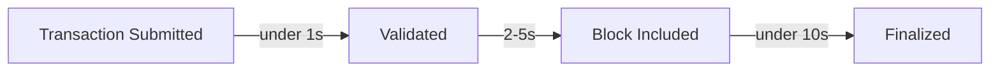
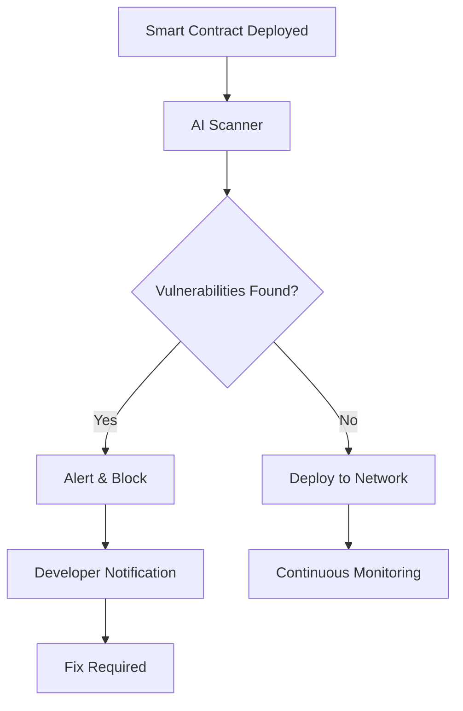
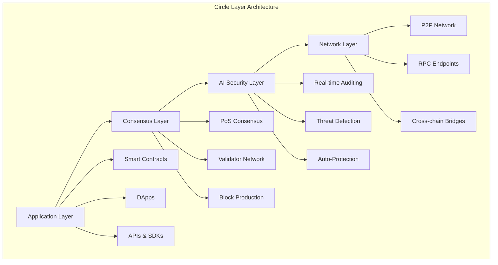

import Tabs from '@theme/Tabs';
import TabItem from '@theme/TabItem';
import '@site/src/css/intro.css';

  <h1 className="hero-title">Welcome to Circle Layer Documentation</h1>
  

    Circle Layer is a high-performance, EVM-compatible, Proof of Stake Layer 1 blockchain designed to power the next generation of decentralized applications.
  

  
  

    <a href="/docs/getting-started/set-up-wallet" className="hero-cta-primary">
      🚀 Get Started
    </a>
    <a href="/docs/development/writing-smart-contracts" className="hero-cta-secondary">
      🏗️ Build Now
    </a>
  

  

    

      
3s

      
Block Time

    

    

      
1-3s

      
Finality

    

    

      
99.95%

      
Uptime

    

  

  

    

  

## 📈 Network Performance Metrics

  

    
3s

    
Block Time

    
⚡ Consistent

  

  
  

    
1-3s

    
Finality

    
🚀 Ultra Fast

  

  
  

    
99.95%

    
Uptime (30d)

    
🔒 Highly Reliable

  

  
  

    
28525

    
Chain ID

    
🌐 Testnet Live

  

## ✨ Key Features

  

    
🚀

    <h3>High Performance</h3>
    
<strong>2,000 TPS</strong> at launch, scaling to <strong>50,000 TPS</strong>

    

      

        

      

      40% of target achieved
    

  

  
  

    
🔒

    <h3>AI Security</h3>
    
Real-time smart contract auditing and threat detection

    

      Real-time Auditing
      Threat Detection
      Auto-Protection
    

  

  
  

    
⚡

    <h3>EVM Compatible</h3>
    
Seamless migration from Ethereum

    

      

        Solidity
        

      

      

        Web3.js
        

      

      

        Metamask
        

      

    

  

  
  

    
🌱

    <h3>Energy Efficient</h3>
    
Proof of Stake consensus mechanism

    

      

        Ethereum PoW
        

        100%
      

      

        Circle Layer
        

        0.1%
      

    

  

## 🔥 Why Choose Circle Layer?

<Tabs>
  <TabItem value="performance" label="🚀 Performance">
    
### Lightning-Fast Transactions

#### Target Performance Metrics

  

    
50,000+

    
🎯 Target TPS

  

  

    
&lt; 1s

    
⚡ Finality

  

  

    
99.9%

    
🌱 Energy Efficient

  

  

    <h4>🎯 Our Target</h4>
    

      

        
⚡ 50,000+ TPS

        
Target Speed

      

      

        
⏱️ Under 1s

        
Finality

      

      

        
🌱 99.9%

        
Less Energy

      

      

        
Circle Layer

        
Blockchain

      

    

  

  
  

    📊 vs EVM L1 Competition:
  

  
  

    

      
Polygon

      
7,000 TPS

    

    
    

      
BSC

      
300 TPS

    

    
    

      
Avalanche

      
4,500 TPS

    

    
    

      
Ethereum

      
15 TPS

    

  

<table>
  <colgroup>
    <col />
    <col />
    <col />
    <col />
  </colgroup>
  <thead>
    <tr>
      <th>Blockchain</th>
      <th>TPS</th>
      <th>Finality</th>
      <th>Energy Usage</th>
    </tr>
  </thead>
  <tbody>
    <tr>
      <td><strong>Circle Layer (Target)</strong></td>
      <td><strong>50,000+</strong> 🎯</td>
      <td><strong>under 1s</strong></td>
      <td><strong>99.9% less</strong></td>
    </tr>
    <tr>
      <td><strong>Circle Layer (Current)</strong></td>
      <td><strong>2,000</strong></td>
      <td><strong>under 10s</strong></td>
      <td><strong>99.9% less</strong></td>
    </tr>
    <tr>
      <td>Polygon</td>
      <td>7,000</td>
      <td>2-3s</td>
      <td>Medium</td>
    </tr>
    <tr>
      <td>BSC</td>
      <td>300</td>
      <td>3s</td>
      <td>Medium</td>
    </tr>
    <tr>
      <td>Avalanche</td>
      <td>4,500</td>
      <td>1-2s</td>
      <td>Low</td>
    </tr>
    <tr>
      <td>Ethereum</td>
      <td>15</td>
      <td>6-10min</td>
      <td>High</td>
    </tr>
  </tbody>
</table>

  

    <h3 className="roadmap-main-title">🚧 Development Roadmap - Phase 1</h3>
    
Target: 50,000 TPS (In Development)

  

  

    

      

        🔬
        How We'll Achieve 50,000 TPS
      

      
      

        

          
⚡

          

            <h4>Parallel Transaction Processing</h4>
            
Multi-threaded execution for maximum throughput

          

        

        
        

          
🔄

          

            <h4>Optimized Consensus</h4>
            
Enhanced PoS with instant finality

          

        

        
        

          
🚀

          

            <h4>State Sharding</h4>
            
Horizontal scaling architecture

          

        

        
        

          
🎯

          

            <h4>EVM Optimization</h4>
            
Custom bytecode improvements

          

        

      

      
      

        📊
        Status: Currently in development - Testnet achieving 2,000+ TPS
      

    

  

  </TabItem>
  
  <TabItem value="security" label="🔒 Security">
    
### AI-Powered Security Suite

**Security Features:**

<ul>
  <li>🤖 <strong>Real-time AI auditing</strong></li>
  <li>🛡️ <strong>Automated threat detection</strong></li>
  <li>⚠️ <strong>Smart contract vulnerability scanning</strong></li>
  <li>🔔 <strong>Instant security alerts</strong></li>
</ul>

  </TabItem>
  
  <TabItem value="ecosystem" label="🌍 Ecosystem">
    
### Growing Ecosystem

  

    
150+

    
Active Validators

  

  

    
25+

    
DApps Built

  

  

    
10K+

    
Community Members

  

**Supported Tools & Frameworks:**

<ul>
  <li>🔧 Hardhat, Truffle, Remix</li>
  <li>🌐 Web3.js, Ethers.js</li>
  <li>💼 MetaMask, WalletConnect</li>
  <li>📊 The Graph, OpenZeppelin</li>
</ul>

  </TabItem>
</Tabs>

## 🚀 Quick Start

  

    

      <h3>🏗️ Developers</h3>
      Easy
    

    
Start building on Circle Layer

    

      
Setup wallet

      
Get testnet tokens

      
Deploy contract

    

    <a href="/docs/development/writing-smart-contracts" className="button button--primary">
      Build Now →
    </a>
  

  
  

    

      <h3>🎯 Validators</h3>
      Medium
    

    
Secure the network and earn rewards

    

      
Up to 8% APY

      
Network rewards

    

    <a href="/docs/nodes-validation/becoming-validator" className="button button--secondary">
      Become a Validator →
    </a>
  

  
  

    

      <h3>👥 Community</h3>
      Beginner
    

    
Join our growing ecosystem

    

      
Discord: 5K+ members

      
Twitter: 15K+ followers

    

    <a href="/docs/community/forums-social-media" className="button button--secondary">
      Get Involved →
    </a>
  

## 🏗️ Architecture Overview

Circle Layer's innovative architecture combines proven blockchain technology with cutting-edge AI security:

## 🚧 In Development

Circle Layer is continuously evolving. Here's what's coming next:

  

    <h4>🏗️ Smart Contract Infrastructure</h4>
    <ul>
      <li>Automated staking contracts</li>
      <li>On-chain governance system</li>
      <li>Cross-chain bridge contracts</li>
      <li>Decentralized oracle network</li>
    </ul>
  

  
  

    <h4>📊 Network Monitoring</h4>
    <ul>
      <li>Real-time status dashboard</li>
      <li>Advanced analytics platform</li>
      <li>Automated alert system</li>
      <li>Enhanced API features</li>
    </ul>
  

## 📚 What's Next?

  

    
Step 1

    <h4>Set Up Your Wallet</h4>
    
Configure MetaMask for Circle Layer testnet

    <a href="/docs/getting-started/set-up-wallet">Start Here →</a>
  

  
  

    
Step 2

    <h4>Explore Architecture</h4>
    
Deep dive into our consensus mechanism

    <a href="/docs/architecture/pos-consensus">Learn More →</a>
  

  
  

    
Step 3

    <h4>Join Community</h4>
    
Connect with developers and validators

    <a href="/docs/community/forums-social-media">Connect →</a>
  

  
🌟 <strong>Ready to build the future?</strong> Circle Layer provides the perfect foundation for your next-generation dApp.

 