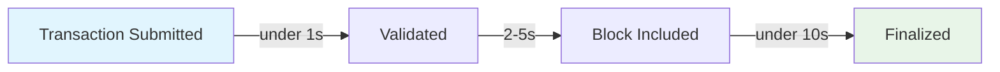
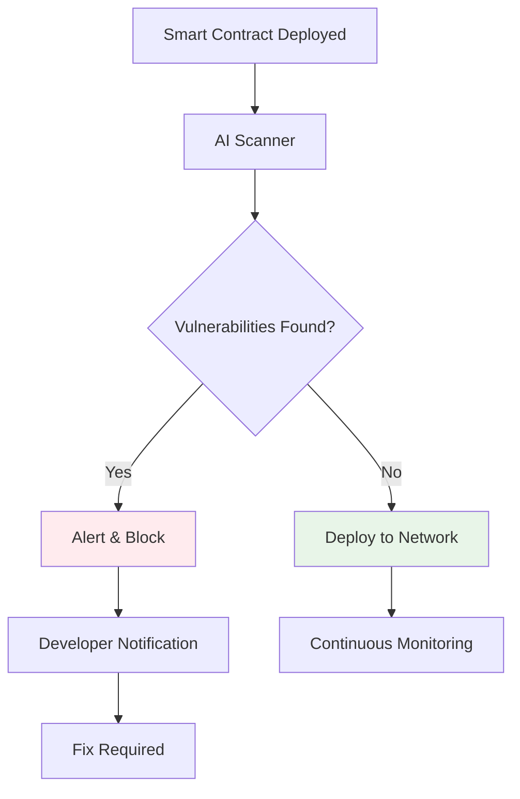
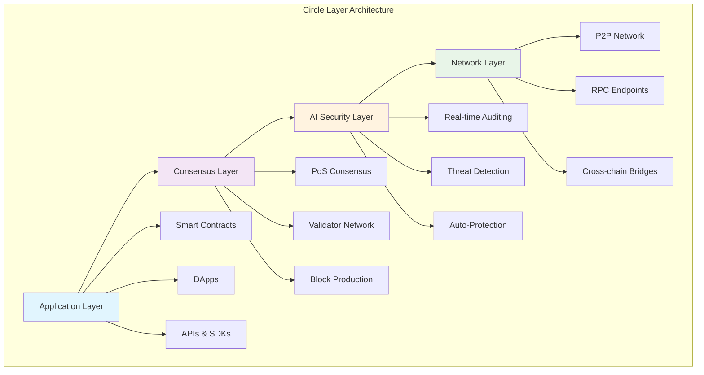

import Tabs from '@theme/Tabs';
import TabItem from '@theme/TabItem';

  

    <picture>
      <source srcSet="/img/dark-theme-logo.png" media="(prefers-color-scheme: dark)" />
      
    </picture>
  

# Welcome to Circle Layer Documentation

Circle Layer is a high-performance, EVM-compatible, Proof of Stake Layer 1 blockchain designed to power the next generation of decentralized applications.

## 📈 Network Performance Metrics

  

    
2,000

    
TPS Current

    
↗️ +15% this month

  

  
  

    
50,000

    
TPS Target

    
🎯 Roadmap 2024

  

  
  

    
&lt;10s

    
Block Finality

    
⚡ Ultra Fast

  

  
  

    
99.9%

    
Uptime

    
🔒 Highly Reliable

  

## ✨ Key Features

  

    
🚀

    <h3>High Performance</h3>
    
<strong>2,000 TPS</strong> at launch, scaling to <strong>50,000 TPS</strong>

    

      

        

      

      40% of target achieved
    

  

  
  

    
🔒

    <h3>AI Security</h3>
    
Real-time smart contract auditing and threat detection

    

      Real-time Auditing
      Threat Detection
      Auto-Protection
    

  

  
  

    
⚡

    <h3>EVM Compatible</h3>
    
Seamless migration from Ethereum

    

      

        Solidity
        

      

      

        Web3.js
        

      

      

        Metamask
        

      

    

  

  
  

    
🌱

    <h3>Energy Efficient</h3>
    
Proof of Stake consensus mechanism

    

      

        Ethereum PoW
        

        100%
      

      

        Circle Layer
        

        0.1%
      

    

  

## 🔥 Why Choose Circle Layer?

<Tabs>
  <TabItem value="performance" label="🚀 Performance">
    
### Lightning-Fast Transactions

**Performance Comparison:**

| Blockchain | TPS | Finality | Energy Usage |
|------------|-----|----------|--------------|
| **Circle Layer** | **2,000** | **under 10s** | **99.9% less** |
| Ethereum | 15 | 6-10min | High |
| Bitcoin | 7 | 60min | Very High |
| Solana | 65,000 | 2.5s | Medium |

  </TabItem>
  
  <TabItem value="security" label="🔒 Security">
    
### AI-Powered Security Suite

**Security Features:**

<ul>
<li>🤖 <strong>Real-time AI auditing</strong></li>
<li>🛡️ <strong>Automated threat detection</strong></li>
<li>⚠️ <strong>Smart contract vulnerability scanning</strong></li>
<li>🔔 <strong>Instant security alerts</strong></li>
</ul>

  </TabItem>
  
  <TabItem value="ecosystem" label="🌍 Ecosystem">
    
### Growing Ecosystem

  

    
150+

    
Active Validators

  

  

    
25+

    
DApps Built

  

  

    
10K+

    
Community Members

  

**Supported Tools & Frameworks:**

<ul>
<li>🔧 Hardhat, Truffle, Remix</li>
<li>🌐 Web3.js, Ethers.js</li>
<li>💼 MetaMask, WalletConnect</li>
<li>📊 The Graph, OpenZeppelin</li>
</ul>

  </TabItem>
</Tabs>

## 🚀 Quick Start

  

    

      <h3>🏗️ Developers</h3>
      Easy
    

    
Start building on Circle Layer

    

      
Setup wallet

      
Get testnet tokens

      
Deploy contract

    

    <a href="/docs/development/writing-smart-contracts" className="button button--primary">
      Build Now →
    </a>
  

  
  

    

      <h3>🎯 Validators</h3>
      Medium
    

    
Secure the network and earn rewards

    

      
Up to 8% APY

      
Network rewards

    

    <a href="/docs/nodes-validation/becoming-validator" className="button button--secondary">
      Become a Validator →
    </a>
  

  
  

    

      <h3>👥 Community</h3>
      Beginner
    

    
Join our growing ecosystem

    

      
Discord: 5K+ members

      
Twitter: 15K+ followers

    

    <a href="/docs/community/forums-social-media" className="button button--secondary">
      Get Involved →
    </a>
  

## 🏗️ Architecture Overview

Circle Layer's innovative architecture combines proven blockchain technology with cutting-edge AI security:

## 📚 What's Next?

  

    
Step 1

    <h4>Set Up Your Wallet</h4>
    
Configure MetaMask for Circle Layer testnet

    <a href="/docs/getting-started/set-up-wallet">Start Here →</a>
  

  
  

    
Step 2

    <h4>Explore Architecture</h4>
    
Deep dive into our consensus mechanism

    <a href="/docs/architecture/pos-consensus">Learn More →</a>
  

  
  

    
Step 3

    <h4>Join Community</h4>
    
Connect with developers and validators

    <a href="/docs/community/forums-social-media">Connect →</a>
  

---

🌟 **Ready to build the future?** Circle Layer provides the perfect foundation for your next-generation dApp. 