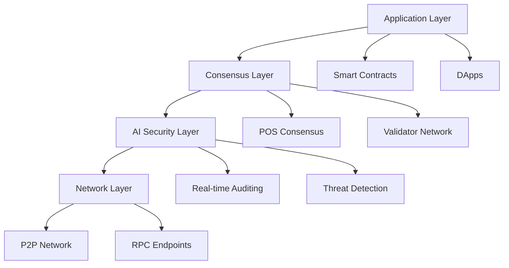

import styles from './intro.module.css';

  

    <picture>
      <source srcSet="/img/dark-theme-logo.png" media="(prefers-color-scheme: dark)" />
      
    </picture>
  

# Welcome to Circle Layer Documentation

Circle Layer is a high-performance, EVM-compatible, Proof of Stake Layer 1 blockchain designed to power the next generation of decentralized applications.

## Key Features

- **🚀 High Performance**: 2,000 TPS at launch, scaling to 50,000 TPS
- **🔒 AI Security**: Real-time smart contract auditing and threat detection
- **⚡ EVM Compatible**: Seamless migration from Ethereum
- **🌱 Energy Efficient**: Proof of Stake consensus mechanism
- **⏱️ Fast Finality**: Sub-10-second transaction finality

## Quick Start

  

    <h3>🏗️ Developers</h3>
    
Start building on Circle Layer

    <a href="/docs/development/writing-smart-contracts" className="button button--primary">
      Build Now
    </a>
  

  
  

    <h3>🎯 Validators</h3>
    
Secure the network and earn rewards

    <a href="/docs/nodes-validation/becoming-validator" className="button button--secondary">
      Become a Validator
    </a>
  

  
  

    <h3>👥 Community</h3>
    
Join our growing ecosystem

    <a href="/docs/community/forums-social-media" className="button button--secondary">
      Get Involved
    </a>
  

## Architecture Overview

Circle Layer's innovative architecture combines proven blockchain technology with cutting-edge AI security:

Ready to get started? Check out our [Getting Started Guide](/docs/getting-started/set-up-wallet) or explore the [Architecture](/docs/architecture/pos-consensus) section. 