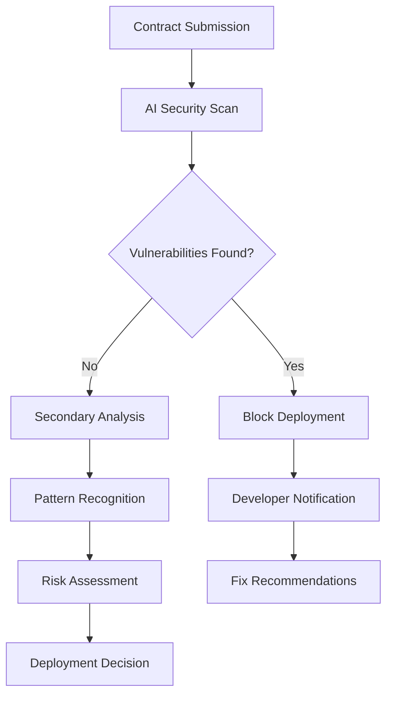

# Phase 2 - Ecosystem Expansion & Security Layer

## Overview

Phase 2 represents Circle Layer's comprehensive ecosystem development phase, where we build a complete DeFi infrastructure, native applications, and advanced security systems before mainnet launch. This strategic approach ensures a battle-tested, production-ready ecosystem.

:::info Strategic Philosophy
Rather than rushing to mainnet, we're investing significant time in building a complete ecosystem on testnet. This approach helps us avoid the major exploits and security issues that have plagued other L1 blockchains.
:::

## Core Objectives

### 🎯 **Build Before Launch Strategy**
- Create a comprehensive DeFi ecosystem
- Test all components under real-world conditions
- Achieve 50,000 TPS performance targets
- Implement AI-powered security layer
- Onboard developer and startup community

### 🛡️ **Security-First Approach**
Learning from incidents in Sui and other ecosystems, we're implementing comprehensive security measures before handling real user funds.

## Key Development Areas

## 🌉 Cross-Chain Infrastructure

### Native Bridge Development

#### Technical Specifications
- **Multi-chain Architecture**: Support for Ethereum, BSC, Polygon, Arbitrum
- **Security Model**: Multi-signature validation with time delays
- **Bridge Pairs**: 4 major trading pairs at launch
  - CLAYER/ETH
  - CLAYER/USDC
  - CLAYER/BTC (wrapped)
  - CLAYER/USDT

#### Development Milestones
- 🔄 **Foundation**: Core bridge architecture
- 🔄 **Security Phase**: Security audits and testing
- 🔄 **Integration**: Multi-chain integration
- 🔄 **Deployment**: Production deployment

### Bridge Security Features
- **Time-locked Withdrawals**: 24-hour delay for large transfers
- **Multi-sig Validation**: 5-of-7 validator consensus
- **Automated Monitoring**: AI-powered anomaly detection
- **Emergency Pause**: Circuit breaker functionality

## 🏦 Native DEX Platform

### Automated Market Maker (AMM)

#### Core Features
- **Advanced AMM Design**: Improved from Uniswap V3 concepts
- **Concentrated Liquidity**: Capital-efficient trading
- **Dynamic Fee Structure**: Adaptive fees based on volatility
- **MEV Protection**: Built-in protection against frontrunning

#### Initial Trading Pairs
1. **CLAYER/ETH** - Primary bridge pair
2. **CLAYER/USDC** - Stable trading pair
3. **CLAYER/BTC** - Bitcoin bridge pair
4. **CLAYER/USDT** - Additional stable pair

#### Liquidity Mining Program
- **Bootstrap Incentives**: High early rewards for liquidity providers
- **Sustainable Tokenomics**: Long-term sustainability model
- **Community Governance**: LPs vote on fee distribution
- **Cross-chain Rewards**: Incentives for bridge users

### DEX Advanced Features
- **Limit Orders**: Advanced order types
- **Multi-hop Routing**: Optimal execution paths
- **Flash Loans**: Capital-efficient DeFi composability
- **Analytics Dashboard**: Real-time trading insights

## 📱 Native Wallet Development

### Mobile-First Approach

#### iOS Application
- **App Store Ready**: Full iOS 16+ compatibility
- **Native Design**: SwiftUI implementation
- **Advanced Security**: Biometric authentication, secure enclave
- **DeFi Integration**: Built-in DEX and bridge access

#### Android Application
- **Play Store Ready**: Android 12+ compatibility
- **Material Design**: Native Android experience
- **Hardware Security**: TEE integration where available
- **Seamless UX**: One-tap DeFi interactions

#### Cross-Platform Features
- **Multi-chain Support**: Manage multiple blockchain assets
- **DeFi Dashboard**: Portfolio tracking and yield farming
- **Social Features**: Easy wallet-to-wallet transfers
- **Educational Content**: Built-in learning resources

### Wallet Security Features
- **Multi-layer Encryption**: Multiple security layers
- **Backup & Recovery**: Social recovery options
- **Transaction Simulation**: Preview transaction outcomes
- **Risk Assessment**: AI-powered security warnings

## 🛡️ Advanced Security Layer (Monad-Inspired)

### Agentic Smart Contract Security

#### Pre-deployment AI Auditing
**Learning from Sui Ecosystem Incidents**



#### AI Security Components

**1. Vulnerability Detection Engine**
- **Known Exploit Patterns**: Database of 10,000+ known vulnerabilities
- **Zero-day Detection**: Machine learning for novel attack vectors
- **Economic Attack Analysis**: MEV and flash loan attack detection
- **Cross-contract Risk**: Multi-contract interaction analysis

**2. Real-time Monitoring System**
- **Transaction Analysis**: Live transaction pattern recognition
- **Anomaly Detection**: Statistical analysis of unusual behavior
- **Risk Scoring**: Real-time risk assessment for all transactions
- **Automatic Response**: Circuit breakers for suspicious activity

**3. Community Protection Features**
- **Honeypot Detection**: Automatic identification of malicious contracts
- **Rug Pull Prevention**: Early warning system for suspicious project behavior
- **Social Engineering Protection**: Warnings for common scam patterns
- **Educational Alerts**: Real-time security education for users

### Security Implementation Timeline

#### Phase 2.1: Foundation
- ✅ Core AI model training
- 🔄 Basic vulnerability scanning
- 🔄 Pattern recognition engine
- 🔄 Developer integration tools

#### Phase 2.2: Advanced Protection
- 🔄 Real-time monitoring system
- 🔄 Automated response mechanisms
- 🔄 Cross-contract analysis
- 🔄 Community alert system

#### Phase 2.3: Ecosystem Integration
- 🔄 DEX integration protection
- 🔄 Bridge security monitoring
- 🔄 Wallet security features
- 🔄 Comprehensive testing

## 🚀 Startup & Community Ecosystem

### Developer Onboarding Program

#### Startup Support Initiative
- **Grant Programs**: $10M+ in developer grants
- **Technical Mentorship**: 1-on-1 support from core team
- **Infrastructure Credits**: Free infrastructure for qualifying projects
- **Go-to-market Support**: Marketing and community support

#### Hackathon Strategy
- **Major Hackathon Participation**: ETHGlobal, Solana Breakpoint, etc.
- **Circle Layer Hackathons**: Quarterly ecosystem hackathons
- **Prize Pools**: $1M+ in total prize distribution
- **Continued Support**: Post-hackathon project incubation

#### Developer Resources
- **Comprehensive Documentation**: Complete API and SDK docs
- **Video Tutorials**: Step-by-step development guides
- **Sample Applications**: Full-stack example projects
- **24/7 Support**: Developer Discord with core team presence

### Community Building
- **Ambassador Program**: Global community leaders
- **Educational Content**: Technical workshops and webinars
- **Conference Presence**: Major blockchain conferences
- **Partnership Program**: Strategic technology partnerships

## 📊 Performance Optimization (Monad-Inspired)

### Parallel Execution Engine
**Target: 50,000 TPS Before Mainnet**

#### Technical Approach
Following Monad's innovative approach to blockchain performance:

**1. Parallel Transaction Processing**
```rust
// Pseudo-code for parallel execution
struct ParallelExecutor {
    thread_pool: ThreadPool,
    state_manager: StateManager,
    dependency_graph: DependencyGraph,
}

impl ParallelExecutor {
    fn execute_block(&self, transactions: Vec<Transaction>) -> BlockResult {
        let dependencies = self.analyze_dependencies(&transactions);
        let execution_groups = self.create_execution_groups(dependencies);

        // Execute independent transaction groups in parallel
        let results = execution_groups
            .par_iter()
            .map(|group| self.execute_group(group))
            .collect();
            
        self.merge_results(results)
    }
}
```

**2. Optimistic Execution with Rollback**
- **Speculative Execution**: Execute transactions optimistically
- **Conflict Detection**: Identify state conflicts post-execution
- **Efficient Rollback**: Quick recovery from conflicts
- **State Caching**: Optimized state management

**3. Advanced State Management**
- **Memory Optimization**: Efficient state tree structures
- **Parallel State Access**: Lock-free state reading
- **Predictive Loading**: AI-powered state prefetching
- **Garbage Collection**: Optimized memory management

#### Performance Testing Strategy
- **Stress Testing**: Continuous high-load testing
- **Real Application Load**: Testing with actual DeFi applications
- **Network Simulation**: Multi-geography network testing
- **Performance Monitoring**: Real-time performance analytics

### Scaling Milestones
- **Early Phase**: 10,000 TPS sustained performance
- **Mid Phase**: 25,000 TPS with full ecosystem
- **Late Phase**: 50,000 TPS production-ready

## Success Criteria & KPIs

### Technical Achievements
- [ ] 50,000 TPS sustained performance
- [ ] < 1 second transaction finality
- [ ] 99.99% network uptime
- [ ] Zero critical security incidents
- [ ] Complete ecosystem development

### Ecosystem Metrics
- [ ] 100+ active projects built on testnet
- [ ] $100M+ TVL on testnet DEX
- [ ] 10,000+ active wallet users
- [ ] 1,000+ developers in community
- [ ] 50+ startup partnerships

### Security Validation
- [ ] 1,000+ contracts audited by AI system
- [ ] Zero successful exploits on protected contracts
- [ ] 99.9% vulnerability detection accuracy
- [ ] Community security program active
- [ ] Multiple independent security audits completed

## Risk Mitigation

### Learning from Other Ecosystems
**Sui Ecosystem Analysis**: Recent incidents in the Sui ecosystem highlight the importance of:
- Comprehensive pre-mainnet testing
- Robust security infrastructure
- Community education and awareness
- Incident response capabilities

### Our Mitigation Strategy
1. **Extended Testnet Phase**: 12+ months of ecosystem testing
2. **Security-First Development**: AI security layer before mainnet
3. **Community Protection**: Education and real-time warnings
4. **Incident Preparedness**: Comprehensive response protocols

## Community Involvement

### Beta Testing Program
- **Early Access**: Limited beta for ecosystem components
- **Feedback Integration**: Direct input into development process
- **Bug Bounty Program**: Rewards for security discoveries
- **Community Governance**: Input on ecosystem priorities

### Developer Community
- **Technical Working Groups**: Specialized development teams
- **Open Source Contributions**: Core infrastructure contributions
- **Documentation Improvements**: Community-driven docs
- **Educational Content**: Community-created tutorials

---

*Phase 2 represents our commitment to building a comprehensive, secure, and production-ready blockchain ecosystem. By investing significant time in testnet ecosystem development, we ensure a superior experience for users, developers, and enterprises when we launch mainnet.* 